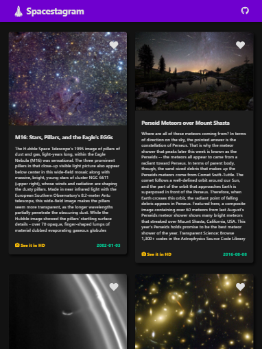

<!--
*** Thanks for checking out the Best-README-Template. If you have a suggestion
*** that would make this better, please fork the repo and create a pull request
*** or simply open an issue with the tag "enhancement".
*** Thanks again! Now go create something AMAZING! :D
***
***
***
*** To avoid retyping too much info. Do a search and replace for the following:
*** martinivnv, spacestagram, email, project_title, project_description
-->

<!-- PROJECT SHIELDS -->
<!--
*** I'm using markdown "reference style" links for readability.
*** Reference links are enclosed in brackets [ ] instead of parentheses ( ).
*** See the bottom of this document for the declaration of the reference variables
*** for contributors-url, forks-url, etc. This is an optional, concise syntax you may use.
*** https://www.markdownguide.org/basic-syntax/#reference-style-links
-->

<!-- PROJECT LOGO -->
<br />
<p align="center">
  <a href="https://github.com/martinivnv/spacestagram">
    
  </a>

  <h3 align="center">Spacestagram - Image Sharing from the Final Frontier</h3>

  <p align="center">
    A React web app for viewing and learning about images from NASA's Astronomy Picture of the Day API.
    <br />
    <a href="https://github.com/martinivnv/spacestagram"><strong>Explore the docs »</strong></a>
    <br />
    <br />
    <a href="https://martinivnv.github.io/spacestagram/">View Demo</a>
    ·
    <a href="https://github.com/martinivnv/spacestagram/issues">Report Bug</a>
    ·
    <a href="https://github.com/martinivnv/spacestagram/issues">Request Feature</a>
  </p>
</p>

<!-- TABLE OF CONTENTS -->
<details open="open">
  <summary><h2 style="display: inline-block">Table of Contents</h2></summary>
  <ol>
    <li>
      <a href="#screenshots">Screenshots</a>
    </li>
    <li>
      <a href="#about-the-project">About The Project</a>
      <ul>
        <li><a href="#built-with">Built With</a></li>
      </ul>
    </li>
    <li>
      <a href="#getting-started">Getting Started</a>
      <ul>
        <li><a href="#prerequisites">Prerequisites</a></li>
        <li><a href="#installation">Installation</a></li>
      </ul>
    </li>
    <li><a href="#usage">Usage</a></li>
    <li><a href="#roadmap">Roadmap</a></li>
    <li><a href="#contributing">Contributing</a></li>
    <li><a href="#contact">Contact</a></li>
  </ol>
</details>

## Images

<p align="center">

    <p align="center">
      Desktop View
    </p>
</p>
<p align="center">

    <p align="center">
      Tablet View
    </p>
</p>
<p align="center">

    <p align="center">
      Mobile View
    </p>
</p>

<!-- ABOUT THE PROJECT -->

## About The Project

This project was built for submission to the Shopify FE Developer Intern Challenge. Some extra things I added not in the assignment were animating the
like button, a loading indicator, and external links to full-size HD images. I also made the app fully responsive to different screen sizes.

### Built With

- React.js
- CSS3
- NASA Astronomy Picture of the Day API

<!-- GETTING STARTED -->

## Getting Started

To get a local copy up and running follow these simple steps.

### Prerequisites

- npm
  ```sh
  npm install npm@latest -g
  ```

### Installation

1. Clone the repo
   ```sh
   git clone https://github.com/martinivnv/spacestagram.git
   ```
2. Install NPM packages for clientside
   ```sh
   cd client
   npm install
   ```
3. Run clientside
   ```sh
   cd client
   npm start
   ```

<!-- USAGE EXAMPLES -->

## Usage

Try it out: [https://martinivnv.github.io/spacestagram/](https://martinivnv.github.io/spacestagram/)

<!-- ROADMAP -->

## Roadmap

See the [open issues](https://github.com/martinivnv/spacestagram/issues) for a list of proposed features (and known issues).

<!-- CONTRIBUTING -->

## Contributing

Contributions are what make the open source community such an amazing place to be learn, inspire, and create. Any contributions you make are **greatly appreciated**.

1. Fork the Project
2. Create your Feature Branch (`git checkout -b feature/AmazingFeature`)
3. Commit your Changes (`git commit -m 'Add some AmazingFeature'`)
4. Push to the Branch (`git push origin feature/AmazingFeature`)
5. Open a Pull Request

<!-- LICENSE -->

## License

Distributed under the MIT License. See `LICENSE` for more information.

<!-- CONTACT -->

## Contact

Martin Ivanov - martinivnv2002@gmail.com

Project Link: [https://github.com/martinivnv/spacestagram](https://github.com/martinivnv/spacestagram)

Live Link: [https://martinivnv.github.io/spacestagram/](https://martinivnv.github.io/spacestagram/)
